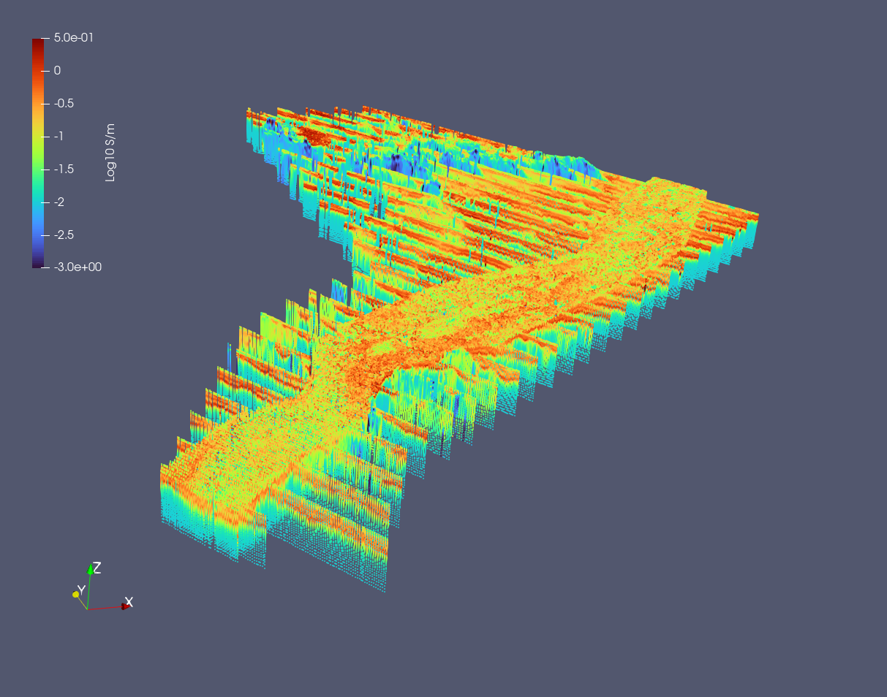

# HiQGA.jl


[](https://geoscienceaustralia.github.io/HiQGA.jl/)

This is a general purpose package for spatial statistical inference, geophysical forward modeling, Bayesian inference and inversion (both deterministic and probabilistic).

Readily usable geophysical forward operators are for AEM, CSEM and MT physics (references underneath), **for which the time domain AEM codes are fairly production-ready**. We've added [SMR](https://github.com/richardt94/SMRPInversion.jl) physics too! The current EM modeling is in 1D, but the inversion framework is dimensionally agnostic (e.g., you can regress images). Adding your own geophysical operators is [easy](https://geoscienceaustralia.github.io/HiQGA.jl/#Developing-HiQGA-or-modifying-it-for-your-own-special-forward-physics)! 

If you don't want to modify HiQGA at all, but simply add your own forward code for inference with HiQGA, check out the Shear Wave Dispersion [SWD](https://github.com/GeoscienceAustralia/HiQGA.jl/master/SWD/examples/SWD) example that uses the `python` based [disba](https://pypi.org/project/disba/) library.

## Installation
To install the latest stable release, in a perfect world we'd use Julia's `Pkg` REPL by hitting `]` to enter `pkg>` mode. Then enter the following, at the `pkg>` prompt:
```
pkg> add HiQGA
```
For the latest development version on here, you'd want to then do
```
pkg> dev HiQGA
```
## Docs
References, detailed instructions for installation, running examples and setting your environment on a cluster are ☞ [](https://geoscienceaustralia.github.io/HiQGA.jl/)

## Authors
- Anandaroop Ray
- Richard Taylor 

## Example AEM inversion

